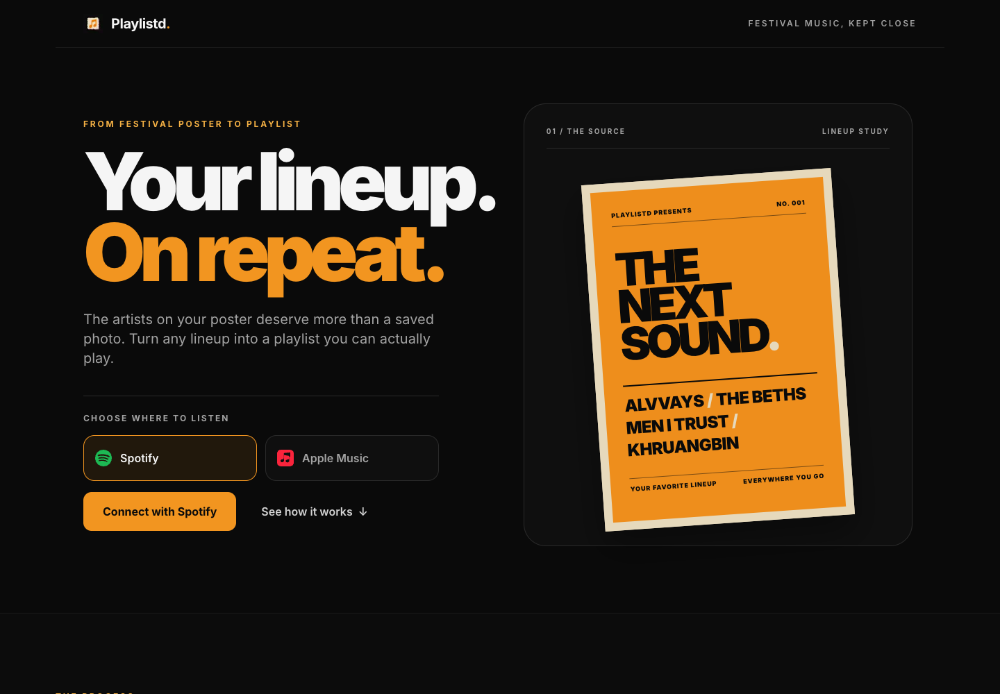
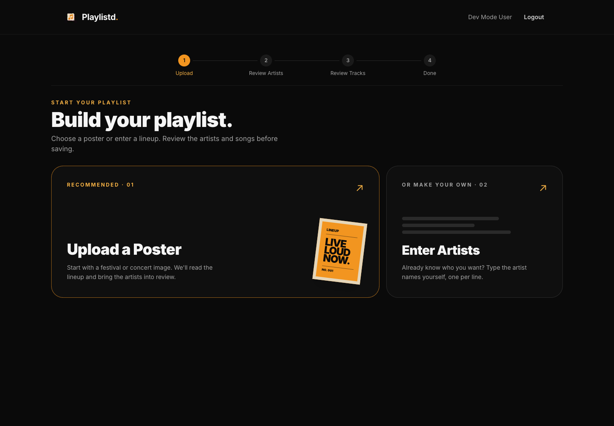
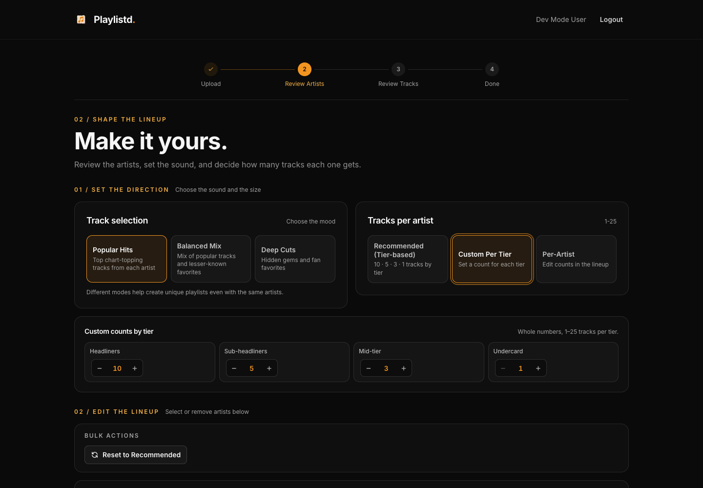
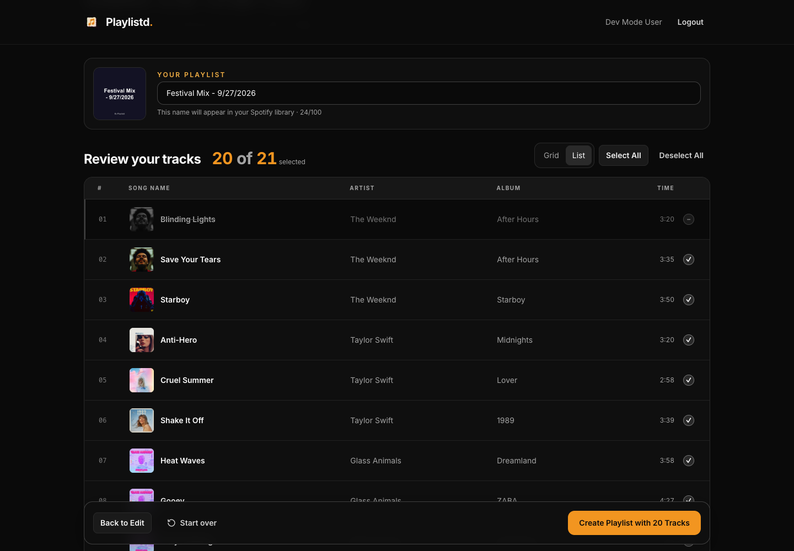
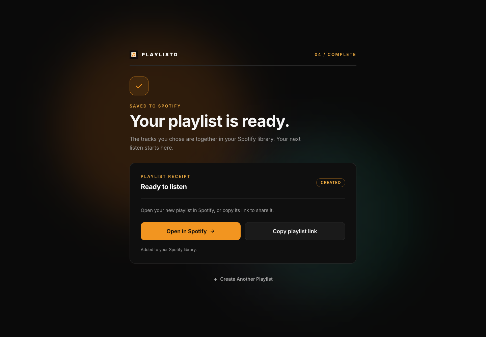

# Playlistd UX refresh

An orange-and-black visual refresh for the existing poster-to-playlist flow. The implementation retains the current authentication, providers, API routes, playlist rules, and draft persistence.

## Design changes

- A new landing page with a poster illustration, concise introduction, and the favicon beside the Playlistd title throughout the flow.
- Clearer poster upload and manual-entry choices, with consistent workflow progress.
- Artist settings above the lineup. Custom tier counts use a full-width row, and per-artist counts stay beside each artist.
- Compact, expandable recommendations and an inline status while library matching runs.
- Playlist name and cover above song selection. The default list names each column and keeps selected songs neutral; excluded songs dim, lose artwork color, and get a struck-through title. The grid remains available.
- Soft, slowly pulsing lights behind the completion screen.
- Consistent loading panels, restrained fades, reduced-motion support, keyboard track selection, and visible focus states.

## Desktop previews

### Landing

### Upload

### Artist settings with custom tier counts

### Track review

### Playlist created

## Mobile previews

[Landing](landing-mobile.png) · [Upload](upload-mobile.png) · [Track review](tracks-mobile.png) · [Playlist created](success-mobile.png)

## Verification

- `npm run lint`: passes with three existing image optimization warnings for track artwork/cover images.
- `npm run typecheck`: passes.
- `npm run build`: passes; all pages and API routes compiled successfully.
- Full test suite: 394 passed across 32 files, including keyboard selection and draft persistence.
- Browser review at 1440px and 390px for landing, upload, artist review, track review, and completion. No browser errors or framework overlays observed.

Screenshots and browser interaction use the existing development mocks. Live Apple Music authentication and real playlist writes were not exercised. Spotify's previously documented limitations remain.
